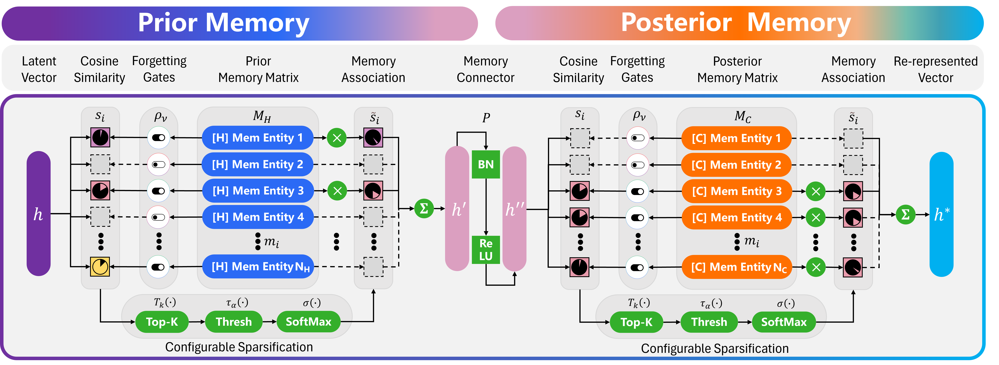

# Cascade Memory for Unsupervised Anomaly Detection
This is the official repository for the ECAI 2024 paper "Cascade Memory for Unsupervised Anomaly Detection".  


# Summary
Unsupervised anomaly detection is to detect previously unseen rare samples without any prior knowledge about them. With the emergence of deep learning, many methods employ normal data reconstruction to train detection models, which is expected to yield relatively large errors when reconstructing anomalies. However, recent studies find that anomalies can be overgeneralized, resulting in reconstruction errors as small as normal samples. In this paper, we examine the anomaly overgeneralization problem and propose global semantic information learning. Normal and anomalous samples may share the same local feature such as textures, edges, and corners, but have separability at the global semantic level. To address this, we propose a novel cascade memory architecture designed to capture global semantic information in the latent space and introduce a configurable sparsification and random forgetting mechanism.


# Getting Started
When preparing the dataset you can place it in the datasets folder and run the preprocess.py to finish the preparation. Run the main.py file to start the experiment.

# Train
The training logic is implemented in train.py in the tool folder.

# Test
The inferencing logic is implemented in evaluation.py in the tool folder.

# Environment
```
keras==2.13.1
matplotlib==3.5.1
numpy==1.24.3
opencv_python==4.6.0.66
opencv_python_headless==4.2.0.34
pandas==1.4.1
Pillow==9.0.1
Pillow==10.4.0
prettytable==3.3.0
pyod==1.1.3
scikit_learn==1.0.2
scipy==1.14.0
seaborn==0.11.2
skimage==0.0
tensorboardX==2.6.2.2
tensorboardX==2.6.2.2
tensorflow==2.13.1
torch==2.1.2
torch_kmeans==0.2.0
torchmetrics==1.2.0
torchstat==0.0.7
torchvision==0.16.2
torchviz==0.0.2
tqdm==4.66.1
wget==3.2
```

# Citation
If you find this repo useful for your research, please consider leaving a star⭐️ and citing the paper

```
Coming soon...
```
